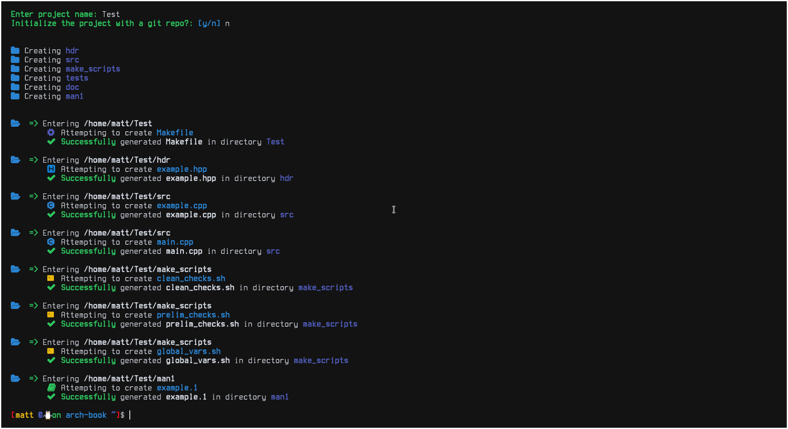

# Riker - The Patricians choice in project generators

## A command line C++ project generator written in Python, For shell dwelling Vimmers whom hate IDE's but still want to automate project generation
<!-- Picture embedded -->



## Current Implemented features
    - [x] Creates a Library style console project (Easily modifiable)
    - [x] Creates Project heiarchy (src, hdr, man1, doc, tests, make_scripts)
    - [x] Creates an advanced flexible Makefile with support scripts
    - [x] builds and links hpp and cpp files out of the box
    - [x] Example man page
    - [x] Gives option to init project with git
    - [x] unicode and emoji support, and sweet Ansi escape colors (as every good CLI should have)

## What will the feature bring (hopefully)
    - [x] Generate Gtkmm projects (Gtk+)
    - [x] Generate Boost Lib projects
    - [x] Generate Ncurses projects
    - [x] Generate X11/X projects
    - [x] Each project should have simple tests already set up and running
    - [x] Give option to integrate Doxygen into each project
    - [x] Specificy C++ versioning

## Installation Process

* I have tried to automate the installation process, and make it as simple as possible
    - install.py handles all the dirty work
    - riker uses pyinstaller to compile down to bytcode
    - this produces one binary, that is faster and simple

### Riker supports Unicode, You will need a patched Nerdfont to see all the fancy symbols
[Here is a link to a nice Nerdfont](https://github.com/ryanoasis/nerd-fonts/blob/master/patched-fonts/SourceCodePro/Regular/complete/Sauce%20Code%20Pro%20Nerd%20Font%20Complete.ttf)
> Click on the 'view raw' button, your browser will automatically download the font, install the font,
> and enable it in your terminal of choice. Note: Gnome-terminal may require you to set the font in 
> system settings, not in the terminal font preferences, but try both methods.

```bash

# first things first... Get dependencies

# make sure you have pip installed (pythons package manager), or pip3 for non Arch users
# here is an example how to install pip3 on Ubuntu
sudo apt install python3-pip

# and on ubuntu you must also install the virtual environment
sudo apt install python3-venv

# if you dont have your c/c++ build tools installed you will need those
sudo apt install build-essential


# Clone the project
git clone https://github.com/mattcoding4days/Riker.git

# cd into the Riker repository and run the installer script

# as always run a script with the -h or --help command to see,
# a list of supported arguments
python3 installer.py -h

# Run the script in either of these two ways
python3 installer.py

# or 
chmod +x installer.py
./intaller.py

# or run with the --debug flag to enable debug logging
python3 installer.py -d


# the installer will make a new directory if you dont already have it,
# at $HOME/.bin - the installer will then add $HOME/.bin to your .profile

# thats it, you must either log out or reboot your machine so you can run riker_run
riker_run

# the installer automatically cleans up after its self, removing the virtual env directories,
# and the build envirnment.

```

## Optional installer script commands that are under development

> [ -v ] to turn debugging verbosity on or off (right now its hardcoded to be on)
> [ -r ] to remove or uninstall riker_run
> [ -u ] to update


## Usage

> Right now it is simple, no flags are impleneted, simply run 'riker_run'
> you will be prompted to enter the desired name of your project.
> Then you will be asked if you want to init a git repo. (currently not working).
> Riker will make the project in the directory that you are in when you run the program
>
> Please Note that Riker has been made to my own specifications and needs, it is for Linux development
> only Make as a build system is supported, Riker revolves around the specifications set forth 
> by my University
>
> Yes, Riker is named after Captain Picards first officer, I am a StarTrek Nerd

## Did my code blow up???

> Currently Riker has only been tested on Arch, and only a little but on Ubuntu

> Please open an issue for your bug report here on github

> If the installer failed you, please attach the output of installer.py to your bug report,
> along with your distro information

## Want Feature X implemented ?

> Please explain why and consider contributing

## Does my code suck???
> Tell me why in a constructive way, and contribute to make it better
